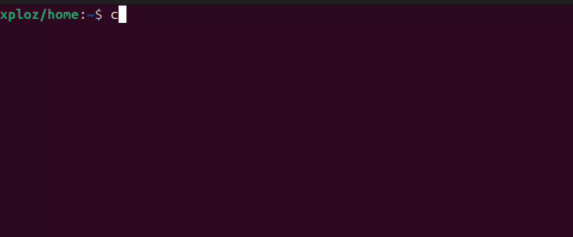

    <h1>Hi there 👋, I'm XPLOZ</h1>

    <h2>Some stats</h2>
    
     
    

    

    <h2>My badges</h2>
    <!-- my-badges start -->

<!-- my-badges end -->

    <h2 style="border-bottom: none; font-size: 40px;">About me 📖</h2>
    

